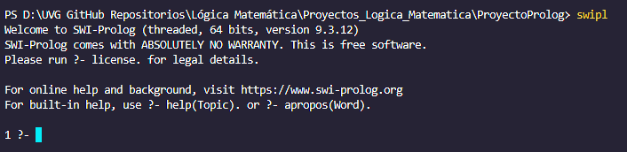
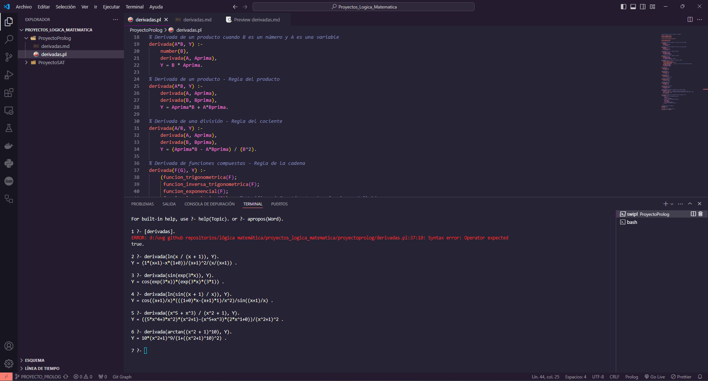

# 📘 Derivador en Prolog

Este programa implementado en **Prolog** permite calcular las derivadas de diferentes tipos de funciones matemáticas: polinomiales, trigonométricas, exponenciales y logarítmicas. Además, hace uso de la **regla de la cadena** para derivar funciones compuestas. 

## 📋 Instrucciones

### 1. **Clona el repositorio**
   Clona el repositorio y selecciona la rama adecuada:
   ```bash
   git clone https://github.com/cor22982/Proyectos_Logica_Matematica.git
   git checkout PROYECTO_PROLOG
   ```

### 2. **Carga el archivo en Prolog**
   Navega a la carpeta del proyecto:
   ```bash
   cd ProyectoProlog
   ```

   Activa el ambiente de Prolog con:
   ```bash
   swipl
   ```

   Carga el archivo `derivadas.pl` para comenzar:
   ```prolog
   [derivadas].
   ```

### 3. **Ejecuta las derivadas**
   A continuación, algunos ejemplos que puedes probar:

   - **Ejemplo 1**: Derivada de un logaritmo natural con una fracción:
     ```prolog
     derivada(ln(x / (x + 1)), Y).
     ```
     **Resultado**: `Y = (1*(x+1)-x*(1+0))/(x+1)^2/(x/(x+1)) .`

   - **Ejemplo 2**: Derivada de una función seno compuesta con una exponencial:
     ```prolog
     derivada(sin(exp(3*x)), Y).
     ```
     **Resultado**: `Y = cos(exp(3*x))*(exp(3*x)*(3*1)) .`

   - **Ejemplo 3**: Derivada de un logaritmo natural compuesto con una función trigonométrica:
     ```prolog
     derivada(ln(sin((x + 1) / x)), Y).
     ```
     **Resultado**: `Y = cos((x+1)/x)*(((1+0)*x-(x+1)*1)/x^2)/sin((x+1)/x) .`

   - **Ejemplo 4**: Derivada de una fracción con polinomios:
     ```prolog
     derivada((x^5 + x^3) / (x^2 + 1), Y).
     ```
     **Resultado**: `Y = ((5*x^4+3*x^2)*(x^2+1)-(x^5+x^3)*(2*x^1+0))/(x^2+1)^2 .`

   - **Ejemplo 5**: Derivada de una función arcotangente con un polinomio elevado a una potencia:
     ```prolog
     derivada(arctan((x^2 + 1)^10), Y).
     ```
     **Resultado**: `Y = 10*(x^2+1)^9/(1+((x^2+1)^10)^2) .`

### 4. **Instalación de Prolog**
   Si aún no tienes Prolog instalado, puedes descargarlo desde el siguiente [enlace](https://www.swi-prolog.org/download/stable).

   Luego, añade la siguiente ruta a las **variables de entorno** en tu sistema:
   ```
   C:\Program Files\swipl\bin
   ```

   Asegúrate de que Prolog esté correctamente instalado ejecutando el siguiente comando en la terminal:
   ```bash
   swipl
   ```

   Ejemplo de instalación exitosa:

   

### 🚀 Funcionalidades

- **Polinomios**: Suma, resta, multiplicación y división.
- **Funciones trigonométricas**: `sin`, `cos`, `tan`.
- **Funciones inversas trigonométricas**: `arctan`.
- **Funciones exponenciales**: `exp`.
- **Funciones logarítmicas**: `ln`.
- **Regla de la cadena** para funciones compuestas.
  
**Nota:** No se simplifica la expresión, solo se indica la derivada.

## 📊 Resultados

### 📸 Imagen del resultado:



### 🎥 Video demostrativo:

[Demostración](https://youtu.be/CRavRnpcqWQ)

## 🔗 Referencias

Este proyecto uso estas referencias para uso de funciones de prolog, sintaxis, documentación, etc.:

- [Tutorial de oficial de Prolog](https://swish.swi-prolog.org/p/Tutorial%20de%20prolog.swinb)
- [Condicionales en Prolog](https://jnjsite.com/prolog-como-hacer-condicionales/)
- [Disyunciones y pertenencia en Prolog](https://www.cs.us.es/~jalonso/cursos/slc-15/temas/tema-2.html)
