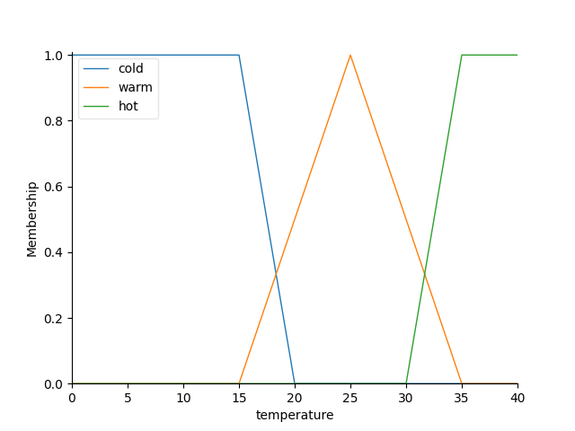
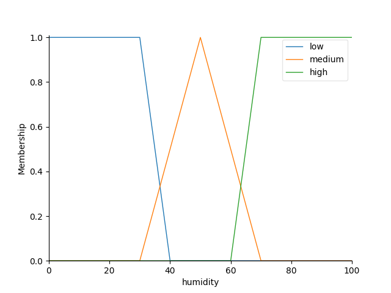
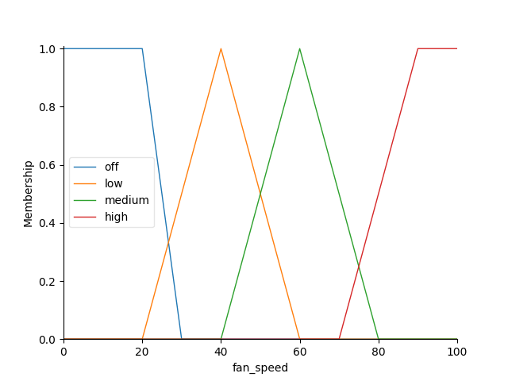
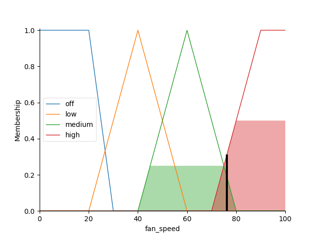

# Proyectos_Logica_Matematica

## Proyecto #4
## Instrucciones del Proyecto
El objetivo de la actividad es reflexionar y aplicar la librería scikit-fuzzy en Python en forma grupal.

### Integrantes:

| Nombre            | Nombre            |
| ----------------- | ----------------- |
| Javier Chen       | Sebastian Estrada |
| Mathew Cordero    | Pedro Guzmán      |
| Gustavo Cruz      | Josué Say         |

## Requerimientos:
- `pip install -r requirements.txt`
- `Tener una carpeta llamada "images" junto al codigo para guardar los resultados`

## Ejecutar:
python main.py

## Resultados:
#### Temperatura

#### Humedad

#### Velocidad del Ventilador

### Resultado de la Simulación

