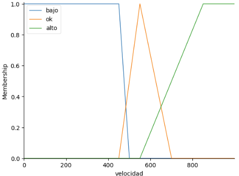
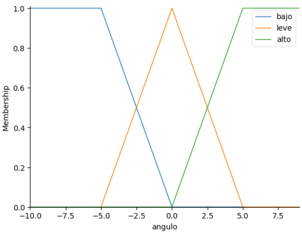
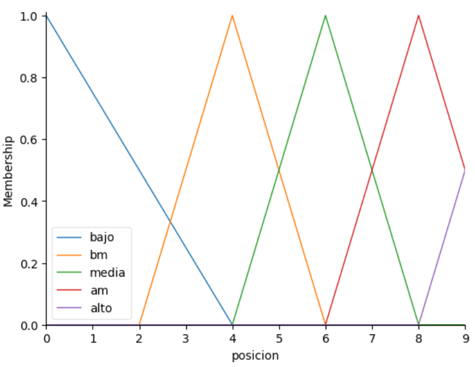
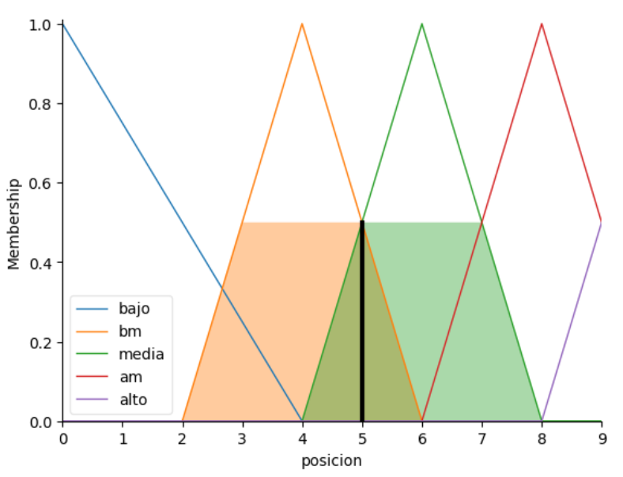

# Proyectos_Logica_Matematica

## Proyecto #4
## Instrucciones del Proyecto
El objetivo de la actividad es reflexionar y aplicar la librería scikit-fuzzy en Python en forma grupal.

### Integrantes:

| Nombre            | Nombre            |
| ----------------- | ----------------- |
| Javier Chen       | Sebastian Estrada |
| Mathew Cordero    | Pedro Guzmán      |
| Gustavo Cruz      | Josué Say         |

## Problema:
Un avión está sujeto a turbulencias, las que causan que el avión baje o suba bruscamente formando un ángulo respecto de su línea de vuelo. Se quiere diseñar un sistema de control difuso para que un piloto automático responda al problema de turbulencia ajustando la posición del timón de la aeronave.

## Requerimientos:
- `pip install -r requirements.txt`

## Ejecutar:
python main.py

## Resultados:
#### Velocidad

#### Ángulo

#### Posición

### Resultado de la Simulación
Entrada:
- `La velocidad es de 515 Kmph`
- `El ángulo es de -2.5 grados` 

## Conclusiones del proyecto:
- La lógica difusa proporciona una herramienta eficaz para sistemas de control en condiciones de incertidumbre y variabilidad.
- Permite obtener soluciones rápidas y simples para problemas complejos, facilitando tanto el proceso de programación como el de determinismo.
- Aunque no es determinista, ofrece resultados dentro de un margen razonable, representando la realidad de manera aproximada.
- La biblioteca `skfuzzy` de Python permite implementar lógica difusa de forma sencilla, incluyendo visualizaciones que facilitan el uso y comprensión.

